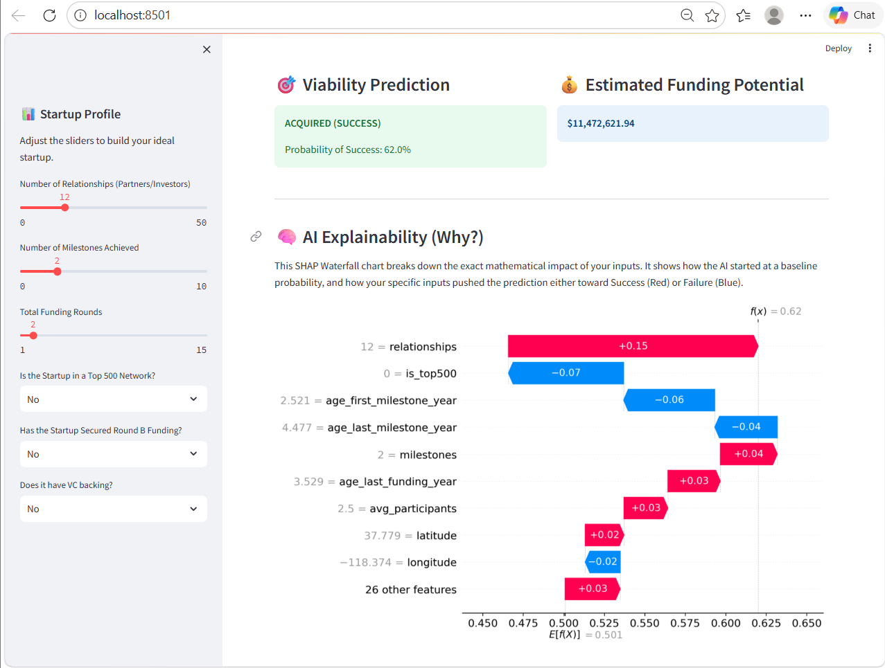

# 🚀 Startup Success Predictor

An end-to-end Machine Learning project that predicts whether a startup will succeed (acquired) or fail (closed), along with estimating its funding potential.

---

## 📌 Project Overview

This project follows a **complete 5-phase ML lifecycle**, transforming raw startup data into a deployable AI-powered web application.

It combines:

* Data Analysis 📊
* Feature Engineering ⚙️
* Machine Learning 🤖
* Explainable AI 🔍
* Web Deployment 🌐

---

## 🧠 Problem Statement

Can we predict:

1. Whether a startup will succeed or fail?
2. How much funding it is likely to raise?

---

## ⚙️ Tech Stack

* **Python**
* **Pandas, NumPy**
* **Scikit-learn**
* **SHAP (Explainable AI)**
* **Streamlit (Web App)**

---

## 🗂️ Project Structure

```
startup-success-predictor/
│
├── data/
│   └── Data.csv
│
├── notebooks/
│   └── eda_runner.py
│
├── src/
│   ├── preprocessing.py
│   ├── train.py
│   ├── predict.py
│   └── evaluate.py
│
├── outputs/
│   └── shap_summary.png
│
├── app.py
├── runner.py
├── requirements.txt
└── README.md
```

---

## 🔄 Project Phases

### ✅ Phase 1: Exploratory Data Analysis (EDA)

* Dataset understanding (923 rows, 49 features)
* Identified data leakage (`labels`)
* Found key success indicators:

  * Relationships
  * Milestones

---

### ✅ Phase 2: Data Preprocessing

* Dropped useless & leaking columns
* Handled missing values (median/mode)
* Encoded categorical variables
* Feature scaling applied

---

### ✅ Phase 3: Model Training

* **RandomForestClassifier**

  * Accuracy: **72.4%**
* **RandomForestRegressor**

  * MAE: **~$11.7M**

---

### ✅ Phase 4: Model Explainability (SHAP)

* Feature importance using SHAP
* Generated:

  * `shap_summary.png`
* Removed black-box behavior

---

### ✅ Phase 5: Web Deployment (Streamlit)

* Interactive UI using Streamlit
* Real-time predictions:

  * Success Probability (%)
  * Estimated Funding ($)
* SHAP waterfall visualization inside app

---

## ▶️ How to Run the Project

### 1. Install dependencies

```
pip install -r requirements.txt
```

### 2. Run training pipeline

```
python runner.py
```

### 3. Launch web app

```
streamlit run app.py
```

---

## 📊 Sample Output

* ✅ Success Probability
* 💰 Funding Prediction
* 📉 SHAP Explanation Graph

---

## 📸 Screenshots



---

## 🌟 Key Highlights

* End-to-end ML pipeline
* Real-world dataset handling
* Explainable AI integration
* Deployable web application

---

## 👩‍💻 Author

**Sonali**

---

## ⭐ If you like this project

Give it a star on GitHub ⭐
