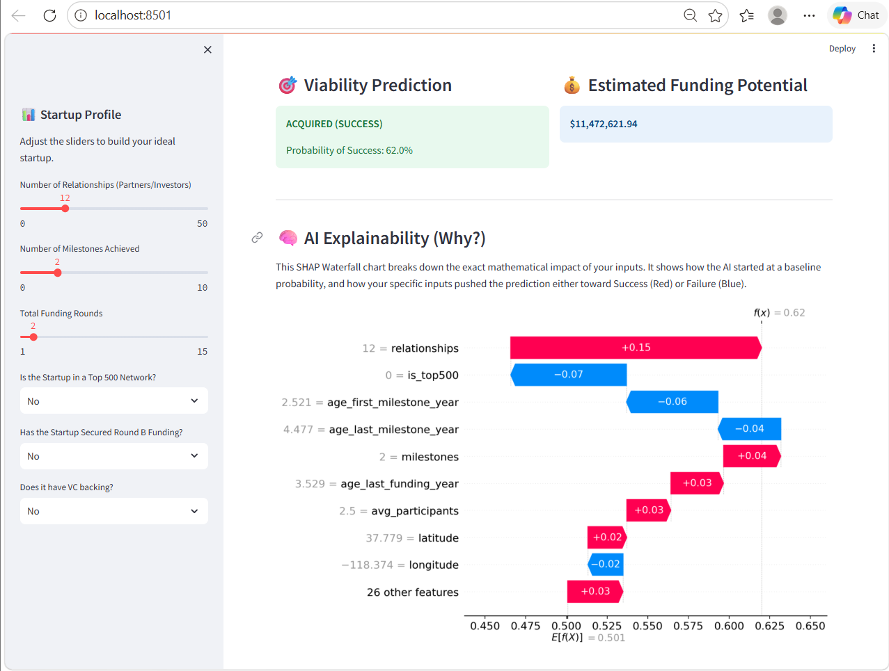

# 🚀 Startup Success Predictor

An end-to-end Machine Learning project that predicts whether a startup will succeed (acquired) or fail (closed), along with estimating its funding potential.

---

## 📌 Project Overview

This project follows a **complete 5-phase ML lifecycle**, transforming raw startup data into a deployable AI-powered web application.

It combines:

* Data Analysis 📊
* Feature Engineering ⚙️
* Machine Learning 🤖
* Explainable AI 🔍
* Web Deployment 🌐

---

## 🧠 Problem Statement

Can we predict:

1. Whether a startup will succeed or fail?
2. How much funding it is likely to raise?

---

## ⚙️ Tech Stack

* **Python**
* **Pandas, NumPy**
* **Scikit-learn**
* **SHAP (Explainable AI)**
* **Streamlit (Web App)**

---

## 🗂️ Project Structure

```
startup-success-predictor/
│
├── data/
│   └── Data.csv
│
├── notebooks/
│   └── eda_runner.py
│
├── src/
│   ├── preprocessing.py
│   ├── train.py
│   ├── evaluate.py
│   ├── metrics.py
│   ├── persistence.py
│   └── predict.py
│
├── tests/
│   ├── test_preprocessing.py
│   ├── test_metrics.py
│   ├── test_persistence.py
│   └── test_evaluate.py
│
├── outputs/
│   └── shap_summary.png
│
├── models/            (generated by `python runner.py`, not committed)
├── app.py
├── runner.py
├── conftest.py
├── requirements.txt
├── requirements-dev.txt
└── README.md
```

---

## 🔄 Project Phases

### ✅ Phase 1: Exploratory Data Analysis (EDA)

* Dataset understanding (923 rows, 49 features)
* Identified data leakage (`labels`, and date-of-outcome columns like `closed_at`)
* Found key success indicators:

  * Relationships
  * Milestones

---

### ✅ Phase 2: Data Preprocessing

* Dropped useless & leaking columns (including `closed_at` -- a company only has a close date if it closed, so this is a near-perfect label leak; caught generically by the date-column drop rule and pinned with a dedicated regression test)
* Handled missing values (median/mode)
* Encoded categorical variables

---

### ✅ Phase 3: Model Training & Honest Evaluation

* **RandomForestClassifier** (`class_weight='balanced'`, 80/20 stratified train/test split)

  * Test accuracy: **77.8%** -- vs. **64.9%** for just always guessing the majority class ("acquired"), so the real lift from the model is what matters, not the raw number in isolation
  * Test ROC-AUC: **0.81**
  * 5-fold stratified cross-validation ROC-AUC: **0.80 (± 0.03)** -- a single train/test split can look noisier than a model actually is on a dataset this size, so this is reported alongside it
  * Per-class recall: **63%** on "closed" outcomes, **86%** on "acquired" -- reported explicitly because overall accuracy alone hides that the model is weaker at catching failures than successes (see Known Limitations)
* **RandomForestRegressor** (funding amount)

  * MAE: **~$15.2M**, RMSE: ~$46.6M -- funding amounts are extremely right-skewed (a handful of huge raises), which is why RMSE is so much larger than MAE; see Known Limitations

All of the numbers above are computed **only on held-out data the model never trained on**, and are saved to `models/metrics.json` by `runner.py` -- they're also what the Streamlit app displays live, not a separate, unvalidated set of numbers.

---

### ✅ Phase 4: Model Explainability (SHAP)

* Feature importance using SHAP
* Generated: `outputs/shap_summary.png` (written only by `runner.py`, as part of training -- see Known Limitations for why this used to also happen on every app launch)
* Removed black-box behavior

---

### ✅ Phase 5: Web Deployment (Streamlit)

* Interactive UI using Streamlit
* Real-time predictions:

  * Success Probability (%)
  * Estimated Funding ($)
* SHAP waterfall visualization inside app
* The app **loads** the model `runner.py` trained and validated -- it does not retrain on startup, so the model you interact with is the same one the metrics above describe.

---

## ▶️ How to Run the Project

### 1. Install dependencies

```bash
pip install -r requirements.txt
```

### 2. Run the training pipeline

```bash
python runner.py
```

This preprocesses the data, trains both models with a held-out evaluation split *and* 5-fold cross-validation, prints and saves the metrics (`models/metrics.json`), regenerates `outputs/shap_summary.png`, and saves the trained models to `models/` (refit on the full dataset for the best final model, once validation is done -- see Known Limitations for the reasoning).

### 3. Launch the web app

```bash
streamlit run app.py
```

The app loads the models saved in step 2 -- if you haven't run `python runner.py` yet, it'll tell you to.

---

## 🧪 Running Tests

```bash
pip install -r requirements-dev.txt
pytest tests/ -v
```

16 tests covering: leaky/identifier columns are actually dropped from the feature matrix (including a dedicated regression test for `closed_at`), no missing values survive imputation, the classification and regression metric calculations against known values, model save/load round-tripping, and that generating a SHAP explainer never writes a file while generating the summary plot always does.

---

## 📊 Sample Output

* ✅ Success Probability
* 💰 Funding Prediction
* 📉 SHAP Explanation Graph

---

## 📸 Screenshots



---

## ⚠️ Known Limitations

* **Recall on failures is lower than on successes** (63% vs. 86%). For a "success predictor," under-catching startups headed for failure is arguably the more costly error type, so this is worth being upfront about rather than letting the headline accuracy number paper over it. Worth exploring: adjusting the classification threshold away from the default 0.5, or trying models/techniques that specifically target recall on the minority class beyond `class_weight='balanced'`.
* **Regression MAE (~$15M) is large relative to typical funding amounts** because a small number of very large raises skew the target heavily. A log-transform of the funding target before training (and un-transforming predictions) would likely help; not yet implemented.
* **The dataset is small (923 rows)** by ML standards, which is part of why cross-validation is reported alongside a single train/test split -- individual splits can be noisy at this size.
* Model retraining previously happened inside the Streamlit app itself, on 100% of the data, with **no held-out validation of the model actually being served** -- and as a side effect, silently overwrote `outputs/shap_summary.png` on every app launch. Both are fixed: training/evaluation now lives only in `runner.py`, which persists the validated model *and* its honest metrics for the app to load, and the SHAP summary plot is only ever regenerated as part of that training run.

---

## 🌟 Key Highlights

* End-to-end ML pipeline with an honest train/test split, cross-validation, and metrics that are actually shown to the end user in the app
* Real-world dataset handling, including a caught label-leakage column (`closed_at`) pinned by a test
* Explainable AI integration, without side-effect file writes from just using the app
* Deployable web application that serves a persisted, validated model rather than retraining blind on every launch
* A small automated test suite (`pytest`) covering the data pipeline, metrics, and persistence logic

---

## 👩‍💻 Author

**Sonali**

---

## ⭐ If you like this project

Give it a star on GitHub ⭐
